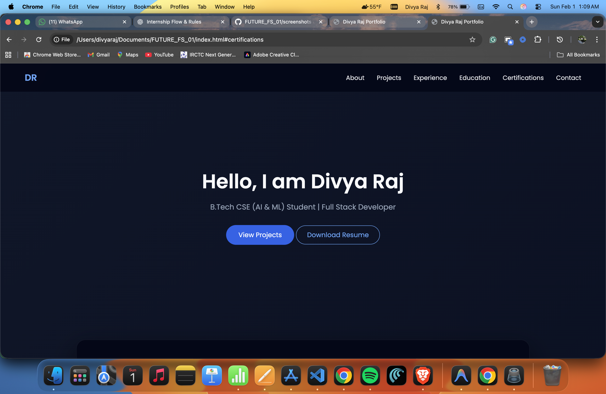
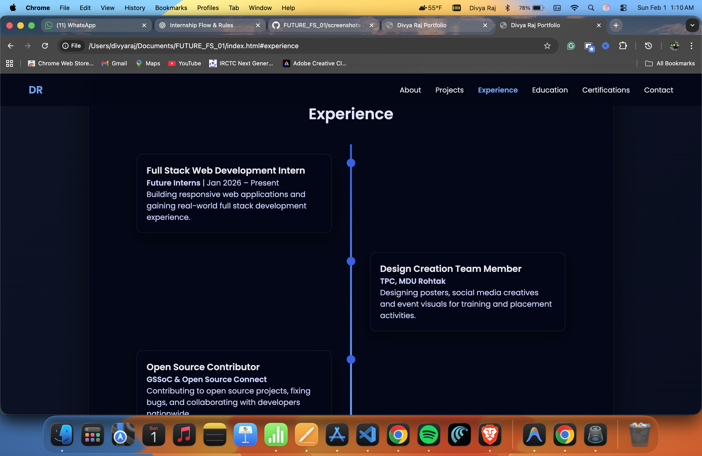

# Personal Portfolio Website

This repository contains my personal portfolio website, created as part of my
Full Stack Web Development Internship.

The portfolio showcases my skills, projects, education, certifications, and
experience in a clean and professional manner. It is designed to represent my
profile as a Computer Science undergraduate and aspiring full stack developer.

---

## Features

- Modern dark themed user interface
- Fully responsive design
- Smooth navigation between sections
- Experience timeline layout
- Projects showcase section
- Education and certifications sections
- Resume download functionality
- Contact section for easy communication

---

## Technologies Used

- HTML5
- CSS3
- JavaScript
- GitHub Pages (for deployment)

---

## Live Website

You can view the live version of this portfolio here:

https://divyaraj0001-design.github.io/FUTURE_FS_01/

---

## Author

Divya Raj  
B.Tech CSE (AI & ML) Student  
Full Stack Development Enthusiast
## Screenshots

### Home

### Experience

### Projects

